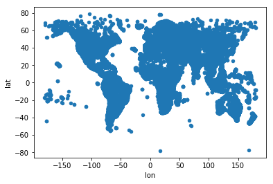
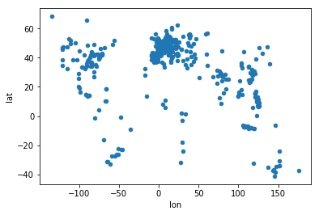
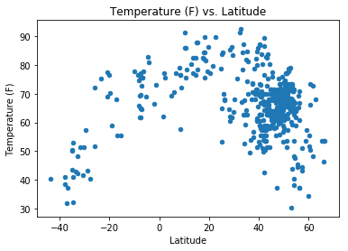
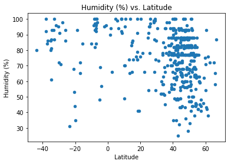
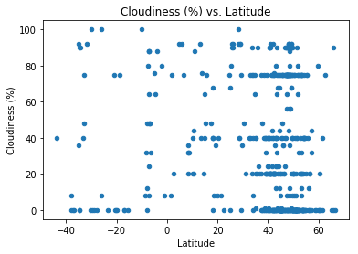
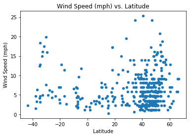

# WeatherPy

### Observations
1. Reported humidity, cloudiness and wind speed are often imprecise, with horizontal lines forming in the scatter plot around multiples of 5.
1. The northern hemisphere is experiencing summer, and it is visible in the temperature skew between cities in the northern and southern hemispheres the same distance from the equator.
1. There seems to be little correlation between cloudiness and latitude.


```python
import json
import pandas as pd
from matplotlib import pyplot as plt
import openweathermapy.core as owm
from config import api_key
```


```python
settings = {"appid": api_key, 'units': 'imperial'}
```

Get OpenWeatherMap's [city list](http://bulk.openweathermap.org/sample/city.list.json.gz) data to sample from by ID. I just reread the instructions and realized I was not supposed to do it this way, but I don't have time to fix it :/


```python
city_data = []

with open('./city.list.json') as f:
    city_data = json.load(f)
    
```


```python
coords = [city['coord'] for city in city_data]
coord_df = pd.DataFrame(coords)
coord_df.plot(kind='scatter', x='lon', y='lat')
plt.show()
```





I wanted to plot the data just to see whether there was anything interesting. I decided to exclude the two cities below latitude -70 as outliers. Not only might they skew the results but the axis range for latitude might change significantly from run to run.


```python
city_ids = pd.DataFrame([{'id': city['id'], 'lat': city['coord']['lat'], 'lon': city['coord']['lon']} for city in city_data])
city_ids = city_ids[city_ids['lat'] > -70]
city_sample = city_ids.sample(500)
city_sample.plot(kind='scatter', x='lon', y='lat')
plt.show()
```





```python
# Get the JSON responses from OWM based on City ID
sample_data = []

for city in city_sample['id'].astype(int):
    sample_data.append(owm.get_current(city, **settings))
```


```python
# Create dataframe from dicts
df_data = []
for city in sample_data:
    city_weather = {}
    city_weather['lat'] = city['coord']['lat']
    city_weather['temp'] = city['main']['temp']
    city_weather['humidity'] = city['main']['humidity']
    city_weather['cloudiness'] = city['clouds']['all']
    city_weather['wind_speed'] = city['wind']['speed']
    df_data.append(city_weather)

weather_df = pd.DataFrame(df_data)
```


```python
weather_df.plot(kind='scatter', x='lat', y='temp')
plt.xlabel('Latitude')
plt.ylabel('Temperature (F)')
plt.title('Temperature (F) vs. Latitude')
plt.show()
```





```python
weather_df.plot(kind='scatter', x='lat', y='humidity')
plt.xlabel('Latitude')
plt.ylabel('Humidity (%)')
plt.title('Humidity (%) vs. Latitude')
plt.show()
```





```python
weather_df.plot(kind='scatter', x='lat', y='cloudiness')
plt.xlabel('Latitude')
plt.ylabel('Cloudiness (%)')
plt.title('Cloudiness (%) vs. Latitude')
plt.show()
```





```python
weather_df.plot(kind='scatter', x='lat', y='wind_speed')
plt.xlabel('Latitude')
plt.ylabel('Wind Speed (mph)')
plt.title('Wind Speed (mph) vs. Latitude')
plt.show()
```




